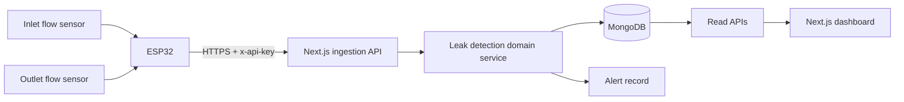

# SmartPipeX

**Hardware-tested IoT pipeline monitoring platform built with ESP32, Next.js, TypeScript, and MongoDB.**


SmartPipeX is an end-to-end IoT monitoring platform that receives paired inlet and outlet flow readings from an ESP32, detects pipeline leaks, calculates water loss, stores telemetry in MongoDB, and visualises real-time operational insights through a modern dashboard.

---

## 🚀 Live Demo

🌐 **Website:** https://smartpipex.vercel.app/

🎥 **Hardware Demonstration:** https://youtu.be/gSAjCysyyeM

📖 **API Documentation:** `docs/API.md`

🏗️ **Architecture:** `docs/ARCHITECTURE.md`

---

> **Demo Note**
>
> The public website runs in **Simulation Mode** because a production MongoDB instance is intentionally not exposed.
>
> The linked hardware demonstration shows SmartPipeX operating with a **real ESP32**, **dual flow sensors**, and the complete telemetry pipeline from physical hardware to the monitoring dashboard.
>
> This allows anyone reviewing the project to experience the dashboard while also verifying that the system has been tested on real hardware.

> **Portfolio Scope**
>
> SmartPipeX demonstrates production-oriented full-stack engineering, IoT integration, REST APIs, telemetry processing, dashboard development, and system architecture.
>
> It is a portfolio project and **not** a certified industrial safety system.

---

## ✨ Key Features

- Real-time pipeline monitoring dashboard
- Hardware-tested ESP32 integration
- Secure telemetry ingestion API
- Water leak detection engine
- Historical analytics and risk scoring
- Alert management system
- Consumption tracking
- MongoDB persistence
- Progressive Web App (PWA)
- ESP32 simulator for local development
- Fully documented architecture and REST API
- GitHub Actions CI
- Responsive dashboard for desktop and mobile

---

## 30-second overview

|                         |                                                                                                                                   |
| ----------------------- | --------------------------------------------------------------------------------------------------------------------------------- |
| **Problem**             | Pipeline leaks are detected by monitoring sustained differences between inlet and outlet water flow.                              |
| **Solution**            | ESP32 receives readings from two flow sensors and securely sends telemetry to a Next.js backend for analysis and visualisation.   |
| **Hardware Validation** | The complete system has been tested using a physical ESP32 with dual flow sensors.                                                |
| **Engineering Focus**   | Clean architecture, secure APIs, typed contracts, testable domain logic, documentation, CI/CD, and production-ready code quality. |

## Hardware demonstration

[](https://youtu.be/gSAjCysyyeM)

## Why this project is technically interesting

- Connects **physical ESP32 hardware** to a production-style web application.
- Keeps leak detection in a **pure, testable domain module** instead of scattering calculations across routes and UI components.
- Protects device ingestion with a timing-safe **API-key comparison**, strict payload validation, bounded flow values, sanitised device IDs, and timestamp-range checks.
- Uses a cached **MongoDB connection pool**, typed collections, indexes, device heartbeat updates, and alert persistence.
- Uses **clearly labelled deterministic simulation data** when MongoDB is not configured. A production database outage fails visibly unless fallback is explicitly enabled for a demo environment.
- Includes responsive dashboards for live status, historical flow, risk, leak events, and consumption.
- Runs linting, TypeScript checks, unit tests, and a production build in **GitHub Actions**.

## System architecture



### Data flow

1. The ESP32 counts pulses from two flow sensors and converts them to litres per minute.
2. The device sends `inputFlow`, `outputFlow`, `timestamp`, and `deviceId` to `POST /api/ingest`.
3. The API validates authentication and payload ranges.
4. The domain service calculates water loss, loss percentage, severity, and a severity score.
5. MongoDB stores the reading, updates device heartbeat, and creates an alert for detected leaks.
6. Dashboard routes expose live, historical, alert, consumption, and risk data.

## Product capabilities

| Area                 | Capability                                                                                                      |
| -------------------- | --------------------------------------------------------------------------------------------------------------- |
| Live monitoring      | Polls the newest reading and shows input, output, efficiency, water loss, and current status                    |
| Leak detection       | Configurable threshold with mild, medium, and critical classification                                           |
| Historical analytics | Recent telemetry history and input-versus-output visualisation                                                  |
| Risk analysis        | Transparent heuristic using leak frequency, average loss, and critical-event ratio                              |
| Alert review         | Severity filtering and event-level telemetry                                                                    |
| Consumption          | Estimated input, delivered volume, water loss, and delivery efficiency                                          |
| Resilience           | Labelled deterministic simulation when MongoDB is not configured, with fail-visible production outage behaviour |
| PWA                  | Installable manifest, offline route, icons, and service-worker shell caching                                    |

## Technology stack

- **Frontend:** Next.js 16 App Router, React 19, TypeScript, Tailwind CSS 4, Recharts, Lucide
- **Backend:** Next.js Route Handlers, MongoDB Node.js driver
- **Hardware:** ESP32, two pulse-based flow sensors, ArduinoJson, NTP time synchronisation
- **Quality:** ESLint, Prettier, Node test runner, GitHub Actions
- **Deployment:** Vercel-compatible serverless application

## Repository structure

```text
SmartPipeX/
├── app/
│   ├── api/                    # Ingestion, telemetry, analytics, and health routes
│   ├── dashboard/              # Operational dashboard pages
│   └── page.tsx                # Recruiter-facing project landing page
├── components/
│   ├── dashboard/              # Domain-specific visual components
│   └── ui/                     # Small reusable UI primitives
├── firmware/
│   ├── smartpipex_esp32.ino    # ESP32 firmware
│   └── config.example.h        # Safe hardware configuration template
├── lib/
│   ├── client/                 # Typed browser API client
│   ├── domain/                 # Leak detection, consumption, and simulation logic
│   ├── server/                 # MongoDB and API helpers
│   └── types.ts                # Shared API and domain contracts
├── scripts/                    # Python ESP32 simulator
├── tests/                      # Domain unit tests
├── docs/                       # Architecture, API, and hardware documentation
└── .github/workflows/ci.yml    # Automated quality gate
```

## Local development

### Prerequisites

- Node.js 22.10 or newer
- npm 10 or newer
- MongoDB 5.0+ (Atlas or local) for hardware ingestion and time-bucket aggregation

### Setup

```bash
# 1. Clone and enter the repository
git clone <your-repository-url>
cd SmartPipeX

# 2. Install locked dependencies
npm ci

# 3. Create local configuration
cp .env.example .env.local

# 4. Start the development server
npm run dev
```

Open `http://localhost:3000`.

The dashboard works immediately in **simulation mode**. Configure `MONGODB_URI` to store real ESP32 readings.

## Environment variables

| Variable                     | Required             | Purpose                                                                                          |
| ---------------------------- | -------------------- | ------------------------------------------------------------------------------------------------ |
| `NEXT_PUBLIC_APP_URL`        | No                   | Canonical deployment URL used in metadata                                                        |
| `MONGODB_URI`                | Hardware mode        | MongoDB connection string; never commit this value                                               |
| `MONGODB_DB`                 | No                   | Database name; defaults to `smartpipex`                                                          |
| `INGEST_API_KEY`             | Production ingestion | Secret sent by devices in the `x-api-key` header                                                 |
| `ENABLE_SIMULATION_FALLBACK` | No                   | Allows labelled simulation after a production database failure; keep `false` for real monitoring |
| `DEFAULT_DEVICE_ID`          | No                   | Restricts dashboard queries to one device when configured                                        |
| `LEAK_THRESHOLD_LPM`         | No                   | Water-loss threshold; defaults to `0.3` L/min                                                    |

## Send a test reading

```bash
curl -X POST http://localhost:3000/api/ingest \
  -H 'Content-Type: application/json' \
  -H 'x-api-key: replace-with-your-key' \
  -d '{
    "deviceId": "ESP32_DEV_PIPELINE_001",
    "timestamp": "2026-07-28T10:00:00.000Z",
    "inputFlow": 3.42,
    "outputFlow": 2.61
  }'
```

Expected response:

```json
{
  "success": true,
  "data": {
    "deviceId": "ESP32_DEV_PIPELINE_001",
    "inputFlow": 3.42,
    "outputFlow": 2.61,
    "waterLoss": 0.81,
    "lossPercentage": 23.7,
    "leakDetected": true,
    "severity": "medium",
    "severityScore": 4.9
  },
  "meta": {
    "stored": true
  }
}
```

## Hardware and simulator

- Follow [docs/HARDWARE.md](docs/HARDWARE.md) for ESP32 wiring, firmware configuration, and deployment.
- A Python simulator is available for testing the complete ingestion path without physical hardware:

```bash
python3 -m venv .venv
source .venv/bin/activate
pip install -r scripts/requirements.txt
python scripts/esp32_simulator.py --url http://localhost:3000/api/ingest --once
```

## Quality checks

```bash
npm run lint
npm run type-check
npm test
npm run format:check
npm run build

# Fast local quality gate (lint + types + tests)
npm run check
```

The unit tests cover normal variation, critical leaks, sensor drift, reading construction, risk categories, timestamp-aware consumption, and telemetry-gap handling.

## Engineering decisions

### Transparent risk model instead of misleading AI claims

The maintenance score is a deterministic heuristic. Its inputs and weights are visible in `lib/domain/leak-detection.ts`, making the result explainable and testable.

### Simulation is a fallback, not disguised production data

Read APIs use deterministic simulation when MongoDB is not configured. Every simulated response carries `source: "simulation"`, and the dashboard displays that source. When MongoDB is configured in production, query failures surface as errors unless `ENABLE_SIMULATION_FALLBACK=true` is deliberately set for a demo deployment.

### Device ingestion fails honestly

`POST /api/ingest` returns `503 DATABASE_NOT_CONFIGURED` when persistence is unavailable. It never returns success for a reading that was not stored.

### Secrets stay outside source control

The repository contains `.env.example`, while `.env*` and `firmware/config.h` are ignored. See [SECURITY.md](SECURITY.md) for reporting and deployment guidance.

## Current limitations

- The firmware uses one shared ingestion key; a fleet deployment should provision per-device credentials and signed requests.
- The ESP32 sends readings directly and does not yet buffer telemetry during a network outage.
- The dashboard uses polling rather than a WebSocket or message-broker stream.
- Leak classification is threshold-based and depends on sensor calibration; it is not a substitute for certified industrial instrumentation.

These constraints are intentional and documented rather than hidden behind portfolio claims.

## Further documentation

- [Architecture and design decisions](docs/ARCHITECTURE.md)
- [REST API reference](docs/API.md)
- [ESP32 hardware integration](docs/HARDWARE.md)
- [Contributing guide](CONTRIBUTING.md)
- [Security policy](SECURITY.md)

## Author

**Vineeth Kundu** — Full-stack engineer and founder building production-oriented web, automation.

[LinkedIn](https://www.linkedin.com/in/vineeth-kundu-99b5222b9/)

## Licence

Released under the [MIT Licence](LICENSE).
